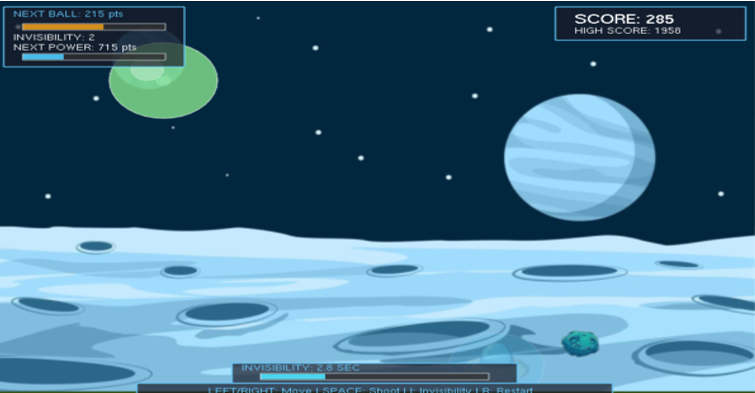
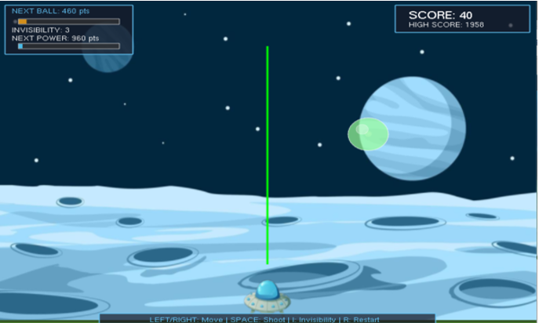
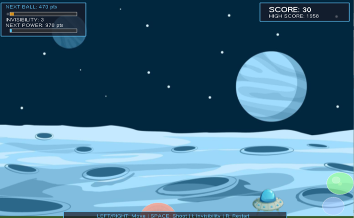
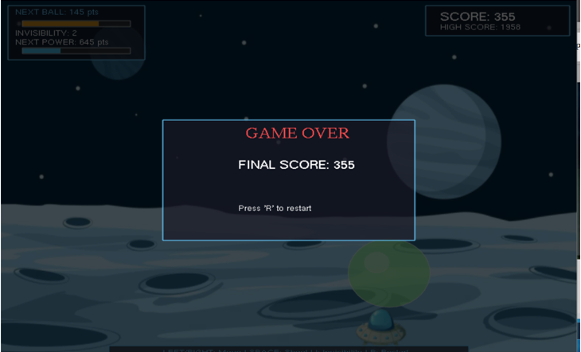

# 👾 UFO STRIKE - Computer Graphics Project

**UFO STRIKE** is a 2D arcade-style shooting game developed using **OpenGL** in C++. Inspired by classic games like Bubble Trouble, the player controls a UFO that must shoot down falling bubbles and avoid deadly meteors. Strategic use of an invisibility power-up adds to the challenge and replayability.

---

## 🎮 Game Features

- Shoot bubbles to split and eliminate them.
- Avoid incoming meteors.
- Activate invisibility to escape tricky situations.
- Score system with high score tracking.
- Smooth animations and real-time interactions.

---

## 🛠️ Technologies Used

- **Language:** C++
- **Graphics Library:** OpenGL (`GL/glut.h`, `GL/glu.h`)
- **Image Loading:** `stb_image.h`
- **Environment:** GLUT (for windowing and rendering)

---

## 📌 Key Computer Graphics Concepts

- **Translation** – Moving the UFO, lasers, meteors, and bubbles.
- **Rotation & Scaling** – Flipping textures, animating objects.
- **Timer Functions** – `glutTimerFunc()` for game loop (~60 FPS).
- **Primitive Types** – `GL_POINTS`, `GL_LINES`, `GL_TRIANGLE_FAN`, `GL_QUADS`, etc.
- **Trigonometry** – Used for drawing circular shapes like bubbles and explosions.
- **Matrix Transformations** – `glTranslatef`, `glRotatef`, `glScalef`.

---

## 🔧 How to Run

1. **Install dependencies:**  
   You need a system with OpenGL and GLUT installed. On Linux:
   ```bash
   sudo apt-get install freeglut3-dev
   
2. **Compile the game:**
   ```bash
   g++ -o UFO_STRIKE main.cpp -lGL -lGLU -lglut
   
3. **Run the game:**
   ```bash
   ./UFO_STRIKE

---   

## 📸 Screenshots

> Below are some example visuals from the game.

### 🛸 Gameplay Interface


### 🟢 Invisibility Mode Activated


### 💥 UFO Shooting Laser


### ☄️ Meteor Explosion


### 🛑 Game Over Window


---

## 👨‍💻 Authors

- **Miet Pamecha** – [102203012]
- **Gautam Dhawan** – [102203061]
- **Priyanshu Naval** – [102203063]

**Department of Computer Science and Engineering**  
Thapar Institute of Engineering and Technology, Patiala  
Academic Year: B.E. 3rd Year (2024–25)
